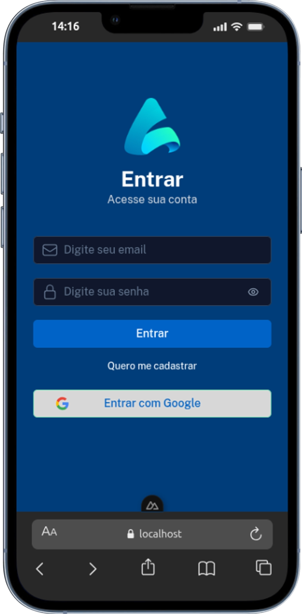
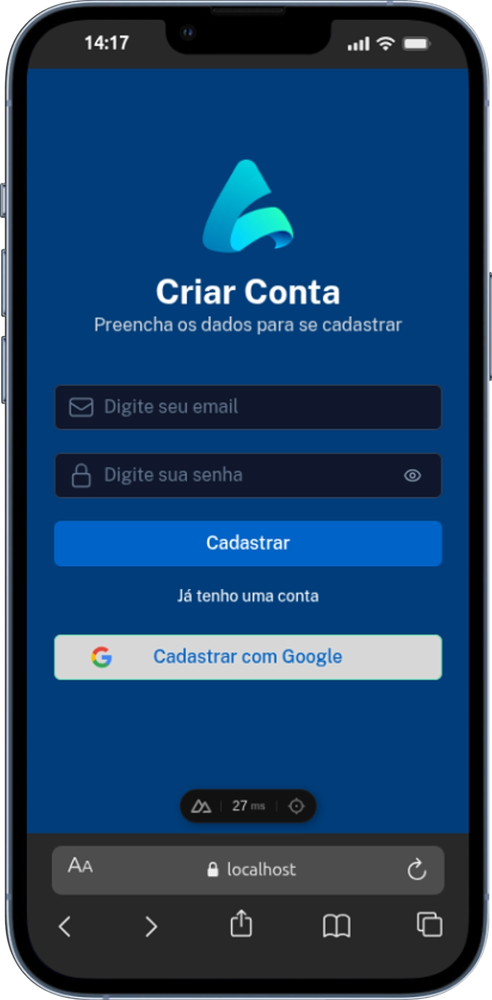
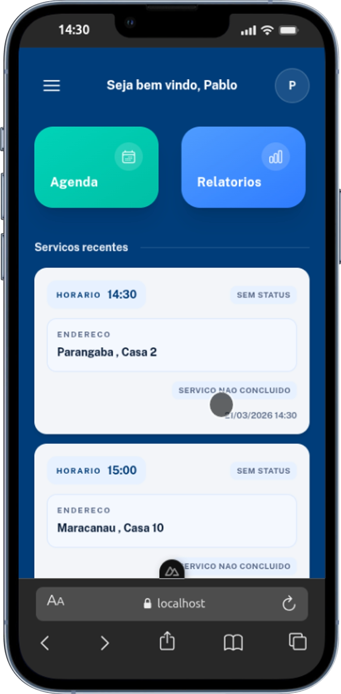
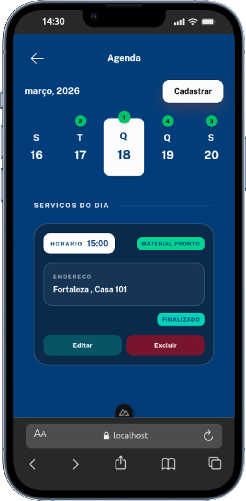
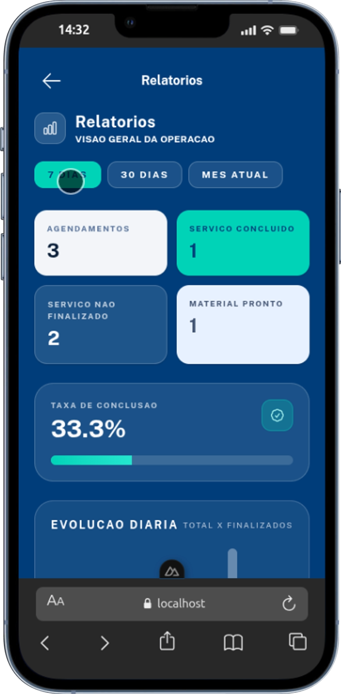
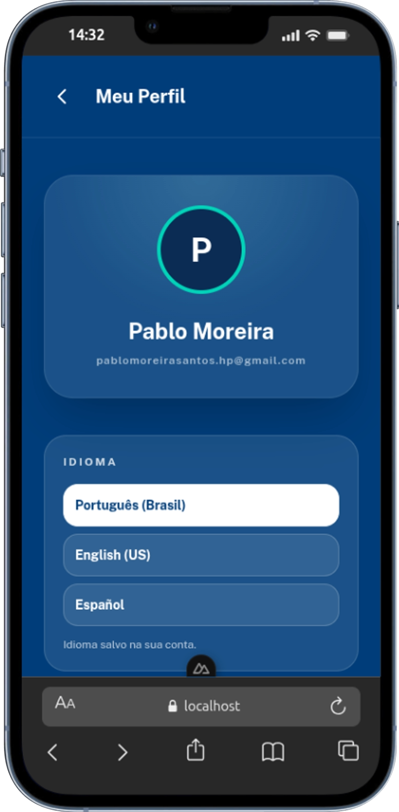

# Agendamento de Servicos

Sistema web de agendamento criado para resolver um problema real do dia a dia: organizar horarios e servicos de forma simples, gratuita e confiavel.

## Mobile First

> Este sistema foi desenvolvido prioritariamente para uso no celular.
> Toda a experiencia atual foi pensada para navegacao mobile no dia a dia.

- Interface otimizada para telas pequenas.
- Fluxo rapido para operacao com uma mao.
- Componentes e navegacao ajustados para uso frequente em smartphone.

## Historia do Projeto

Este projeto nasceu de uma necessidade familiar.

Meu pai atende muitos clientes e, com o volume de atendimentos, comecou a ficar dificil lembrar com precisao o dia e a hora de cada servico. Procuramos uma alternativa gratuita no mercado, mas nada atendia bem o que ele precisava.

Entao desenvolvi esta aplicacao especialmente para ele.

Hoje ele e usuario ativo do sistema e usa todos os dias para agendar servicos. O projeto segue em evolucao continua, sempre com novas ideias e melhorias baseadas nas necessidades reais do uso diario.

Uma das ultimas features adicionadas foi o controle de material por servico, indicando se o material daquele atendimento ja esta pronto ou nao.

## Objetivo

- Entregar uma solucao gratuita e pratica para gestao de agendamentos.
- Melhorar a organizacao do trabalho diario.
- Reduzir esquecimentos de data/hora dos atendimentos.
- Evoluir continuamente com base em uso real.

## Publico e Plataforma

Este sistema foi projetado com foco principal em experiencia mobile (web para celular).

Observacao importante:

- A versao atual e mobile-first.
- A grande atualizacao planejada e uma versao otimizada para tablets e telas maiores, com melhor aproveitamento de layout em dispositivos amplos.

## Galeria Mobile

<div align="center">

<table style="margin: 0 auto; border-collapse: collapse; border-spacing: 0; border: none;">
<tr>
<td width="33%" align="center" style="border: none; padding: 0;">
  
  <br><small style="color: #666; font-weight: 500; margin-top: 10px; display: block;">Login</small>
</td>
<td width="33%" align="center" style="border: none; padding: 0;">
  
  <br><small style="color: #666; font-weight: 500; margin-top: 10px; display: block;">Cadastro</small>
</td>
<td width="33%" align="center" style="border: none; padding: 0;">
  
  <br><small style="color: #666; font-weight: 500; margin-top: 10px; display: block;">Dashboard</small>
</td>
</tr>

<tr>
<td width="33%" align="center" style="border: none; padding: 0;">
  
  <br><small style="color: #666; font-weight: 500; margin-top: 10px; display: block;">Agenda</small>
</td>
<td width="33%" align="center" style="border: none; padding: 0;">
  
  <br><small style="color: #666; font-weight: 500; margin-top: 10px; display: block;">Relatórios</small>
</td>
<td width="33%" align="center" style="border: none; padding: 0;">
  
  <br><small style="color: #666; font-weight: 500; margin-top: 10px; display: block;">Perfil</small>
</td>
</tr>
</table>

</div>

## Fluxo do Usuario

1. O usuario faz login com email/senha ou Google.
2. Acessa o dashboard e visualiza os atalhos principais e os servicos recentes.
3. Entra na agenda para criar, editar, excluir ou consultar agendamentos.
4. Seleciona o dia no carrossel e acompanha os servicos daquele dia.
5. Marca status do servico e material (pronto, sem material ou nao informado).
6. Consulta relatorios para acompanhar desempenho, volume e indicadores.
7. Ajusta preferencias no perfil (idioma e tema).

## Funcionalidades por Pagina

### Login (`/`)

- Autenticacao com email/senha.
- Login com Google.
- Tratamento de erros de autenticacao com feedback via toast.

### Cadastro (`/register`)

- Criacao de conta com email/senha.
- Envio de verificacao de email.
- Cadastro/login rapido com Google.

### Recuperacao/Definicao de senha (`/reset-password`)

- Validacao de link de redefinicao recebido por email.
- Definicao de nova senha.
- Login automatico apos sucesso.

### Dashboard (`/dashboard`)

- Saudacao do usuario.
- Atalhos rapidos para agenda e relatorios.
- Lista de servicos recentes com status e acesso direto ao item na agenda.

### Agenda (`/schedule`)

- Visualizacao diaria com carrossel de dias do mes.
- Lista dos servicos do dia selecionado.
- Cadastro, edicao e exclusao de agendamentos.
- Modal de detalhes do servico.
- Confirmacao de exclusao.
- Status de servico concluido e material pronto.

### Relatorios (`/reports`)

- Filtro por periodo (7 dias, 30 dias e mes atual).
- Cards de resumo (total, concluidos, nao concluidos, material pronto).
- Taxa de conclusao.
- Evolucao diaria.
- Indicadores de material.
- Insights rapidos e top clientes.

### Perfil (`/profile`)

- Dados do usuario.
- Preferencias de idioma.
- Selecao de tema (claro/escuro).
- Informacoes da conta.

## Stack Tecnologica

- `Nuxt 4` (SPA com `ssr: false`)
- `Vue 3` + Composition API
- `TypeScript`
- `Nuxt UI`
- `Tailwind CSS`
- `Firebase`
  - Authentication
  - Firestore
- `date-fns` para manipulacao de datas

## Firebase e Integracoes

### Firebase Authentication

- Login com email/senha.
- Login social com Google.
- Verificacao de email.
- Fluxo de redefinicao de senha.

### Firestore

- Persistencia dos agendamentos.
- Persistencia de configuracoes do usuario (tema/idioma).

### Integracao Google

- Entrada com conta Google para agilizar autenticacao.
- Tratamento de cenarios como credencial divergente e cancelamento de popup.

## Seguranca e Configuracao

As configuracoes do Firebase sao carregadas por variaveis de ambiente via `runtimeConfig.public`.

Nao deixe credenciais fixas em codigo.

1. Copie o arquivo de exemplo:

```bash
cp .env.example .env
```

2. Preencha as variaveis no `.env`:

- `NUXT_PUBLIC_FIREBASE_API_KEY`
- `NUXT_PUBLIC_FIREBASE_AUTH_DOMAIN`
- `NUXT_PUBLIC_FIREBASE_PROJECT_ID`
- `NUXT_PUBLIC_FIREBASE_STORAGE_BUCKET`
- `NUXT_PUBLIC_FIREBASE_MESSAGING_SENDER_ID`
- `NUXT_PUBLIC_FIREBASE_APP_ID`
- `NUXT_PUBLIC_FIREBASE_MEASUREMENT_ID` (opcional)

## Como Rodar o Projeto

Instalar dependencias:

```bash
pnpm install
```

Executar em desenvolvimento:

```bash
pnpm dev
```

Rodar lint:

```bash
pnpm lint
```

Build de producao:

```bash
pnpm build
```

Preview de producao:

```bash
pnpm preview
```

## Proximos Passos (Roadmap)

- Criacao de testes unitarios no front-end.
- Melhorias de layout para tablet e telas maiores.
- Exportacao de documentos (CSV/SVC e PDF).
- Evolucao continua de UX com base no uso diario real.

## Status

Projeto em uso real e evolucao ativa.

Cada atualizacao e guiada por necessidade pratica de operacao no dia a dia.
