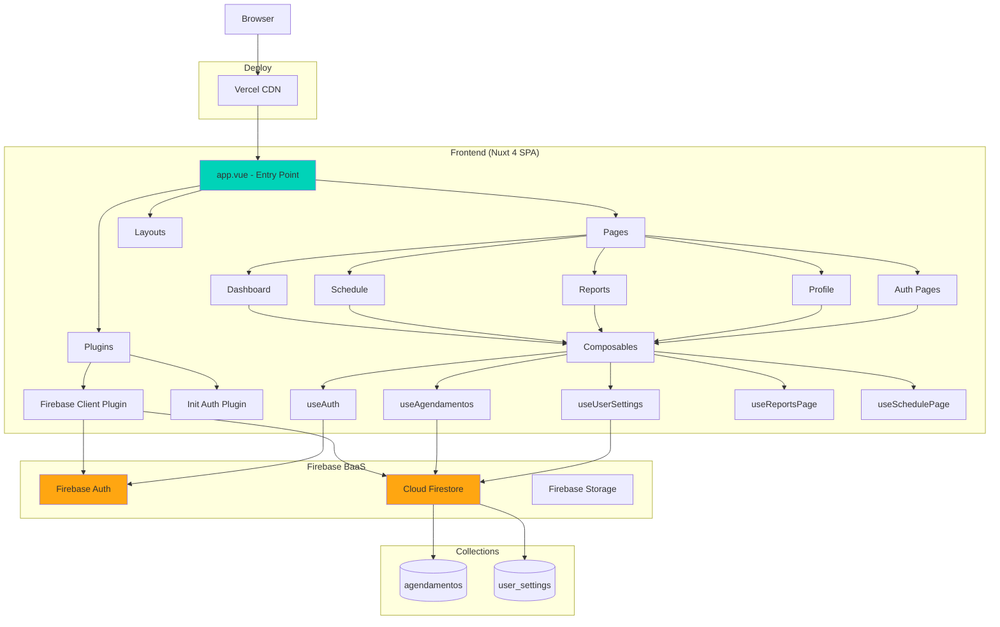

# ANÁLISE TÉCNICA V1 — SISTEMA DE AGENDAMENTO

> **Data da análise:** 31/08/2026  
> **Escopo:** Fotografia técnica completa da V1 para planejamento da V2  
> **Metodologia:** Análise estática do código-fonte, sem execução ou alteração do projeto

---

## 1. Visão Geral

### Objetivo do Sistema

Sistema de agendamento de serviços residenciais, focado em profissionais autônomos ou pequenas empresas que precisam organizar visitas técnicas/serviços em domicílio. O sistema permite gerenciar clientes, endereços, horários e status de serviços.

### Funcionalidades Existentes

| Funcionalidade | Descrição |
|----------------|-----------|
| Autenticação | Login com e-mail/senha e Google OAuth |
| Cadastro de usuários | Registro com verificação de e-mail |
| Recuperação de senha | Fluxo completo via e-mail |
| Dashboard | Visão geral com últimos serviços |
| Agenda | Carrossel de dias com agendamentos |
| CRUD de agendamentos | Criar, editar, excluir serviços |
| Detalhes do serviço | Visualização completa do agendamento |
| Relatórios | Métricas de serviços (7d, 30d, mês) |
| Perfil | Configurações de idioma e tema |
| Internacionalização | 3 idiomas (PT-BR, EN-US, ES-ES) |
| Temas | Dark mode (padrão) e Light mode |

### Principais Fluxos

1. **Fluxo de autenticação:** Login → Verificação de e-mail → Dashboard
2. **Fluxo de agendamento:** Selecionar dia → Preencher formulário → Salvar → Listar
3. **Fluxo de edição:** Clicar no agendamento → Editar modal → Salvar
4. **Fluxo de exclusão:** Clicar em excluir → Confirmar → Remover

---

## 2. Stack

| Tecnologia | Versão | Finalidade | Onde identificada |
|------------|--------|------------|-------------------|
| Node.js | 22 | Runtime | `.github/workflows/ci.yml:12` |
| pnpm | 10.29.2 | Gerenciador de pacotes | `package.json:34` |
| Nuxt | ^4.3.1 | Framework Vue (meta-framework) | `package.json:20` |
| Vue | 3.x | Framework frontend (via Nuxt) | Implícito em `nuxt.config.ts` |
| TypeScript | ^5.9.3 | Tipagem estática | `package.json:30` |
| Tailwind CSS | ^4.1.18 | Estilização utility-first | `package.json:21` |
| @nuxt/ui | ^4.4.0 | Componentes UI | `package.json:17` |
| Firebase | ^12.9.0 | Backend-as-a-Service (Auth + Firestore) | `package.json:19` |
| date-fns | ^4.1.0 | Manipulação de datas | `package.json:18` |
| @heroicons/vue | ^2.2.0 | Ícones SVG | `package.json:14` |
| unplugin-icons | ^23.0.1 | Iconify integration | `package.json:31` |
| ESLint | ^10.0.0 | Linting | `package.json:26` |
| Prettier | ^3.8.1 | Formatação | `package.json:29` |
| vue-tsc | ^3.2.4 | Type checking Vue | `package.json:32` |

---

## 3. Estrutura

```
agendamento/
├── app/
│   ├── assets/css/
│   │   └── main.css              # Configuração Tailwind + variáveis CSS (temas)
│   ├── components/
│   │   ├── auth/                 # Componentes de autenticação
│   │   │   ├── AuthPageShell.vue
│   │   │   └── AuthPasswordInput.vue
│   │   ├── dashboard/            # Componentes do dashboard
│   │   │   ├── DashboardTopBar.vue
│   │   │   ├── DashboardQuickActions.vue
│   │   │   └── DashboardRecentServicesSection.vue
│   │   ├── profile/              # Componentes de perfil
│   │   │   ├── ProfileAccountInfoCard.vue
│   │   │   ├── ProfileSettingsCard.vue
│   │   │   ├── ProfileUserCard.vue
│   │   │   └── ProfilePageHeader.vue
│   │   ├── reports/              # Componentes de relatórios
│   │   │   ├── ReportsQuickInsights.vue
│   │   │   ├── ReportsPageHeader.vue
│   │   │   └── ReportsSummaryCards.vue
│   │   ├── schedule/             # Componentes da agenda
│   │   │   ├── ScheduleAppointmentsList.vue
│   │   │   ├── ScheduleDaysCarousel.vue
│   │   │   ├── ScheduleConfirmDeleteModal.vue
│   │   │   ├── ScheduleServiceDetailsModal.vue
│   │   │   └── ScheduleHeader.vue
│   │   ├── BottomNav.vue         # Navegação mobile (bottom)
│   │   ├── DashboardSidebar.vue  # Menu lateral
│   │   └── ModalAgendamento.vue  # Modal criar/editar agendamento
│   ├── composables/
│   │   ├── useAgendamentos.ts    # CRUD de agendamentos (Firebase)
│   │   ├── useAppI18n.ts         # Internacionalização
│   │   ├── useAuth.ts            # Autenticação Firebase
│   │   ├── useLoginPage.ts       # Lógica da página de login
│   │   ├── useRegisterPage.ts    # Lógica da página de registro
│   │   ├── useResetPasswordPage.ts # Lógica de reset de senha
│   │   ├── useReportsPage.ts     # Lógica de relatórios
│   │   ├── useSchedulePage.ts    # Lógica da página de agenda
│   │   ├── useTheme.ts           # Gerenciamento de tema
│   │   └── useUserSettings.ts    # Preferências do usuário
│   ├── i18n/
│   │   ├── en-US.ts              # Traduções inglês
│   │   ├── es-ES.ts              # Traduções espanhol
│   │   └── pt-BR.ts              # Traduções português
│   ├── layouts/
│   │   └── app.vue               # Layout base (sidebar + conteúdo)
│   ├── middleware/
│   │   ├── auth.ts               # Proteção de rotas autenticadas
│   │   └── legacy-routes.global.ts # Redirects de rotas antigas
│   ├── pages/
│   │   ├── auth/action.vue       # Handler de ações (verificação, reset)
│   │   ├── dashboard/index.vue   # Dashboard
│   │   ├── index.vue             # Login
│   │   ├── profile/index.vue     # Perfil do usuário
│   │   ├── register/index.vue    # Registro
│   │   ├── reports/index.vue     # Relatórios
│   │   ├── reset-password/index.vue # Reset de senha
│   │   └── schedule/index.vue    # Agenda
│   ├── plugins/
│   │   ├── firebase.client.ts    # Inicialização Firebase
│   │   └── initAuth.client.ts    # Inicialização do Auth
│   ├── types/
│   │   └── agendamento.ts        # Tipos TypeScript
│   ├── app.config.ts             # Configuração do app Nuxt
│   └── app.vue                   # Entry point do app
├── docs/
│   └── images/                   # Screenshots para README
├── public/
│   ├── favicon.ico
│   ├── icon.png
│   └── logo.png
├── .github/workflows/
│   └── ci.yml                    # Pipeline CI (lint + typecheck)
├── .nuxt/                        # Build gerado pelo Nuxt
├── .editorconfig
├── .env                          # Variáveis de ambiente (gitignored)
├── .env.example                  # Template de variáveis
├── .gitignore
├── eslint.config.mjs             # Configuração ESLint
├── LICENSE                       # MIT License
├── nuxt.config.ts                # Configuração Nuxt
├── package.json
├── pnpm-lock.yaml
├── pnpm-workspace.yaml
├── README.md
├── renovate.json                 # Automação de dependências
├── tailwind.config.ts            # Configuração Tailwind
├── tsconfig.json                 # Configuração TypeScript
└── vercel.json                   # Configuração deploy Vercel (SPA)
```

### Responsabilidade das Pastas

| Pasta | Responsabilidade |
|-------|------------------|
| `components/` | Componentes Vue reutilizáveis, organizados por domínio |
| `composables/` | Lógica reutilizável (Composition API), estado global |
| `pages/` | Rotas do Nuxt (file-based routing) |
| `layouts/` | Templates de página |
| `plugins/` | Inicialização de serviços (Firebase) |
| `middleware/` | Interceptadores de rota |
| `i18n/` | Dicionários de tradução |
| `types/` | Definições de tipos TypeScript |
| `assets/` | Recursos estáticos (CSS) |

---

## 4. Arquitetura

### Padrão Arquitetural

O sistema segue uma arquitetura **SPA (Single Page Application)** com **Backend-as-a-Service (BaaS)** usando Firebase. Não há backend tradicional — toda a lógica de negócio está no frontend, comunicando-se diretamente com Firebase Auth e Cloud Firestore.

### Diagrama de Arquitetura



### Comunicação entre Camadas

1. **Frontend → Firebase Auth:** Login, registro, logout, verificação de e-mail, reset de senha
2. **Frontend → Firestore:** CRUD de agendamentos, leitura/escrita de configurações
3. **Estado global:** Gerenciado via `useState` do Nuxt (reativo, compartilhado entre componentes)
4. **Sessão:** Armazenada em `localStorage` com expiração de 7 dias

---

## 5. Funcionalidades

### Funcionalidades Existentes e Localização

| Funcionalidade | Tipo | Localização |
|----------------|------|-------------|
| Login com e-mail | Página | `app/pages/index.vue` |
| Login com Google | Página | `app/pages/index.vue` |
| Registro com e-mail | Página | `app/pages/register/index.vue` |
| Registro com Google | Página | `app/pages/register/index.vue` |
| Verificação de e-mail | Página | `app/pages/auth/action.vue` |
| Reset de senha | Página | `app/pages/reset-password/index.vue` |
| Dashboard | Página | `app/pages/dashboard/index.vue` |
| Listagem de agendamentos | Página | `app/pages/schedule/index.vue` |
| Criar agendamento | Modal | `app/components/ModalAgendamento.vue` |
| Editar agendamento | Modal | `app/components/ModalAgendamento.vue` |
| Excluir agendamento | Modal | `app/components/schedule/ScheduleConfirmDeleteModal.vue` |
| Detalhes do agendamento | Modal | `app/components/schedule/ScheduleServiceDetailsModal.vue` |
| Carrossel de dias | Componente | `app/components/schedule/ScheduleDaysCarousel.vue` |
| Lista de serviços do dia | Componente | `app/components/schedule/ScheduleAppointmentsList.vue` |
| Relatórios (7d/30d/mês) | Página | `app/pages/reports/index.vue` |
| Troca de idioma | Composable | `app/composables/useUserSettings.ts` |
| Troca de tema | Composable | `app/composables/useTheme.ts` |
| Sidebar navigation | Componente | `app/components/DashboardSidebar.vue` |
| Bottom navigation | Componente | `app/components/BottomNav.vue` |
| Logout | Composable | `app/composables/useAuth.ts` |

---

## 6. Fluxo de Agendamento

### Criação

```
1. Usuário clica em "Cadastrar" (ScheduleHeader.vue:59)
2. ModalAgendamento.vue abre com formulário
3. Usuário preenche:
   - Nome do cliente (obrigatório)
   - Número da casa (obrigatório)
   - Endereço (obrigatório)
   - Horário (obrigatório, select 07:00-20:00 em intervalos de 30min)
   - Descrição do serviço (opcional)
   - Material pronto (opcional: sim/não/null)
   - Status do serviço (opcional: concluído/não/null)
   - Telefone (opcional)
   - Referência (opcional)
   - Observações (opcional)
4. Validação frontend (ModalAgendamento.vue:123-126)
5. Emite evento 'salvar' com dados formatados
6. useSchedulePage.handleSalvarAgendamento processa
7. useAgendamentos.criarAgendamento salva no Firestore
8. Recarrega lista de agendamentos
```

### Consulta

```
1. useSchedulePage observa mudança de usuário
2. Chama listarAgendamentos() do composable useAgendamentos
3. Query Firestore: where('userId', '==', user.uid)
4. Retorna todos os agendamentos do usuário
5. Filtra por dia selecionado (agendamentosFiltrados computed)
6. Ordena por horário
7. Exibe na ScheduleAppointmentsList
```

### Alteração

```
1. Usuário clica em "Edit" no card do agendamento
2. ModalAgendamento abre com dados preenchidos (watch em modelValue)
3. Usuário altera campos
4. Validação frontend
5. Emite 'salvar' com id do agendamento
6. useAgendamentos.editarAgendamento atualiza no Firestore
7. Recarrega lista
```

### Cancelamento/Exclusão

```
1. Usuário clica em "Delete" no card
2. ScheduleConfirmDeleteModal abre para confirmação
3. Usuário confirma
4. useAgendamentos.excluirAgendamento remove do Firestore
5. Recarrega lista
```

### Disponibilidade e Regras de Negócio

| Regra | Implementação | Local |
|-------|---------------|-------|
| Horários disponíveis | 07:00 às 20:00, intervalos de 30min | `ModalAgendamento.vue:44-51` |
| Campos obrigatórios | cliente, numeroCasa, endereco, data | `useAgendamentos.ts:34-44` |
| Validação de e-mail | Regex simples | `useLoginPage.ts:25-28` |
| Senha mínima | 6 caracteres | `useLoginPage.ts:43` |
| Sessão expira | 7 dias | `useAuth.ts:14` |
| E-mail não verificado | Bloqueia login | `useLoginPage.ts:113-122` |
| Conta Google-only | Detecta e orienta usuário | `useAuth.ts:138-143` |

### Regras NÃO Implementadas (identificado)

- Não há verificação de conflito de horário
- Não há limite de agendamentos por dia
- Não há validação de formato de telefone
- Não há busca/CEP automático
- Não há notificações por e-mail/push sobre agendamentos

---

## 7. Dados

### Banco de Dados

**Cloud Firestore** (NoSQL, documento-coleção)

### Coleções

#### `agendamentos`

| Campo | Tipo | Obrigatório | Descrição |
|-------|------|-------------|-----------|
| `id` | string (auto) | Gerado | ID do documento Firestore |
| `cliente` | string | Sim | Nome do cliente |
| `numeroCasa` | string | Sim | Número da casa |
| `endereco` | string | Sim | Endereço completo |
| `descricao` | string | Sim | Descrição do serviço |
| `materialPronto` | boolean/null | Não | Se material está no local |
| `servicoConcluido` | boolean/null | Não | Status de conclusão |
| `telefone` | string | Não | Telefone do cliente |
| `referencia` | string | Não | Ponto de referência |
| `observacoes` | string | Não | Observações adicionais |
| `userId` | string | Sim | ID do usuário dono |
| `createdAt` | Timestamp | Sim | Data de criação |
| `data` | Timestamp | Sim | Data/hora agendada |

**Arquivo:** `app/types/agendamento.ts:3-17`

#### `user_settings`

| Campo | Tipo | Obrigatório | Descrição |
|-------|------|-------------|-----------|
| `language` | string | Sim | 'pt-BR', 'en-US' ou 'es-ES' |
| `theme` | string | Sim | 'light' ou 'dark' |
| `updatedAt` | Timestamp | Não | Última atualização |

**Arquivo:** `app/composables/useUserSettings.ts:8-11`

### Relacionamentos

```
User (Firebase Auth)
    │
    ├── 1:N ──→ agendamentos (via userId)
    │
    └── 1:1 ──→ user_settings (via documentId = user.uid)
```

### Queries Relevantes

```typescript
// Listar agendamentos do usuário
query(collection($db, 'agendamentos'), where('userId', '==', user.value.uid))
// Local: useAgendamentos.ts:137

// Carregar configurações
doc($db, 'user_settings', user.value.uid)
// Local: useUserSettings.ts:87

// Salvar configurações (merge)
setDoc(ref, { language, updatedAt }, { merge: true })
// Local: useUserSettings.ts:119-126
```

### Persistência Local

| Dado | Storage | Local |
|------|---------|-------|
| Sessão auth | `localStorage` | `agendamento-auth-session` |
| Configurações | `localStorage` | `agendamento-user-settings` |
| Persistência Firebase | `browserLocalPersistence` | Firebase SDK |

---

## 8. Segurança

### Autenticação

| Aspecto | Status | Detalhes |
|---------|--------|----------|
| Métodos suportados | ✅ | E-mail/senha + Google OAuth |
| Verificação de e-mail | ✅ | Obrigatória para login com senha |
| Sessão | ✅ | 7 dias, localStorage |
| Persistência Firebase | ✅ | browserLocalPersistence |

**Arquivo:** `app/composables/useAuth.ts`

### Autorização

| Aspecto | Status | Detalhes |
|---------|--------|----------|
| Proteção de rotas | ✅ | Middleware `auth.ts` |
| Isolamento de dados | ⚠️ | Via query `where('userId', '==', ...)` |
| Regras Firestore | ❓ | Não identificado no projeto |

**Arquivo:** `app/middleware/auth.ts`

### Proteção de Rotas

```typescript
// middleware/auth.ts
defineNuxtRouteMiddleware(async () => {
  const { user, loading } = useAuth()
  // Aguarda loading, redirecia para / se não autenticado
})
```

**Observação:** A proteção é apenas client-side. Sem regras no Firestore, dados podem ser acessados manipulando o cliente.

### Tokens/Cookies

| Aspecto | Status | Detalhes |
|---------|--------|----------|
| JWT Firebase | ✅ | Gerenciado pelo SDK (interno) |
| Session custom | ✅ | localStorage com expiração |
| HttpOnly cookies | ❌ | Não utilizado |
| CSRF protection | N/A | Firebase SDK gerencia |

### Armazenamento de Credenciais

| Aspecto | Status | Detalhes |
|---------|--------|----------|
| Senhas | ✅ | Firebase Auth (hash bcrypt) |
| API Keys | ⚠️ | Expo em runtime client |
| Secrets backend | N/A | Não há backend |

### Secrets

**Arquivo:** `.env.example`

```
NUXT_PUBLIC_FIREBASE_API_KEY
NUXT_PUBLIC_FIREBASE_AUTH_DOMAIN
NUXT_PUBLIC_FIREBASE_PROJECT_ID
NUXT_PUBLIC_FIREBASE_STORAGE_BUCKET
NUXT_PUBLIC_FIREBASE_MESSAGING_SENDER_ID
NUXT_PUBLIC_FIREBASE_APP_ID
NUXT_PUBLIC_FIREBASE_MEASUREMENT_ID
NUXT_PUBLIC_APP_URL
```

**⚠️ Nota:** O `.env.example` contém valores reais de API key (linhas 6-12). Embora sejam valores "public" do Firebase (necessários para o cliente), é uma prática expor template com valores reais.

### Validações

| Validação | Local | Status |
|-----------|-------|--------|
| E-mail formato | `useLoginPage.ts:25-28` | ✅ Regex básica |
| Senha tamanho | `useLoginPage.ts:43` | ✅ Mínimo 6 chars |
| Campos obrigatórios | `useAgendamentos.ts:34-44` | ✅ |
| Sanitização inputs | - | ❌ Não identificada |

### CORS

| Aspecto | Status | Detalhes |
|---------|--------|----------|
| Configuração CORS | N/A | Firebase SDK gerencia |
| Headers custom | ❌ | Não configurado |

### Exposição de Dados

| Risco | Severidade | Descrição |
|-------|------------|-----------|
| API Key Firebase exposta | 🟢 Baixo | Esperado para SPAs, mas requer regras Firestore |
| UID exposto no perfil | 🟡 Médio | `ProfileAccountInfoCard.vue:39` mostra UID parcial |
| Dados em localStorage | 🟡 Médio | Sessão e settings sem criptografia |
| Sem regras Firestore | 🔴 Crítico | Qualquer usuário autenticado pode ler/escrever qualquer documento |

### Possíveis Vulnerabilidades

| Problema | Severidade | Local | Impacto |
|----------|------------|-------|---------|
| Sem regras Firestore | 🔴 Crítico | Firebase Console | Acesso indevido a dados de outros usuários |
| Sem validação de domínio | 🟠 Alto | `nuxt.config.ts` | Qualquer origem pode usar a API Key |
| Sem rate limiting | 🟠 Alto | Login/Registro | Ataque de força bruta |
| XSS via innerHTML | 🟡 Médio | `v-html` não usado, mas dados não sanitizados | Potencial injeção |
| Sem CSP headers | 🟡 Médio | `nuxt.config.ts` | Permite execução de scripts não autorizados |
| Sem HTTPS enforce | 🟡 Médio | Vercel config | Tráfego não criptografado |
| localStorage sensível | 🟡 Médio | `useAuth.ts:77` | Sessão acessível via JS |

---

## 9. Integrações

### Firebase

| Serviço | Uso | Local |
|---------|-----|-------|
| Authentication | Login, registro, OAuth | `app/plugins/firebase.client.ts` |
| Cloud Firestore | Banco de dados | `app/plugins/firebase.client.ts` |
| Storage | Não identificado | Importado mas não utilizado |

### APIs Externas

| API | Finalidade | Status |
|-----|------------|--------|
| Google OAuth | Login social | ✅ Implementado |
| ViaCEP/Buscor CEP | Não identificado | ❌ Não implementado |
| SendGrid/SES | Não identificado | ❌ Não implementado |

### E-mail

| Tipo | Implementação | Local |
|------|---------------|-------|
| Verificação de conta | Firebase Auth | `useRegisterPage.ts:68` |
| Reset de senha | Firebase Auth | `useAuth.ts:214` |
| Notificações | Não identificado | ❌ Não implementado |

### WhatsApp

**Não identificado no projeto analisado.**

---

## 10. Performance

### Frontend

| Aspecto | Status | Detalhes |
|---------|--------|----------|
| Bundle size | ⚠️ | Nuxt 4 + Firebase + Tailwind = bundle considerável |
| Code splitting | ✅ | Automático via Nuxt (pages) |
| Lazy loading | ⚠️ | Não identificado para componentes |
| Tree shaking | ✅ | Via Nuxt/Vite |
| Imagens otimizadas | ❌ | Sem otimização identificada |

### Backend (Firebase)

| Aspecto | Status | Detalhes |
|---------|--------|----------|
| Queries | ⚠️ | Sem índices compostos definidos no código |
| Paginação | ❌ | Não implementada - carrega TODOS os agendamentos |
| Real-time | ❌ | Não utiliza listeners (sempre refetch) |

### Gargalos Identificados

| Problema | Severidade | Local | Impacto |
|----------|------------|-------|---------|
| Carregamento total | 🟠 Alto | `useAgendamentos.ts:137` | O(n) - cresce com número de agendamentos |
| Sem cache | 🟡 Médio | `useSchedulePage.ts:80` | Refetch a cada mudança |
| Re-renders | 🟡 Médio | `computed` chains | Muitos computed dependentes |
| Bundle Firebase | 🟡 Médio | `firebase` import | ~200KB+ gzipped |
| Sem paginação | 🟡 Médio | `ScheduleAppointmentsList.vue` | Renderiza todos os itens |

### Cache

| Tipo | Implementação | Local |
|------|---------------|-------|
| Nuxt useState | ✅ | Estado global reativo |
| localStorage | ✅ | Sessão e settings |
| Firebase cache | ✅ | Offline persistence habilitado |
| HTTP cache | ❌ | Não configurado |
| Service Worker | ❌ | Não implementado |

---

## 11. Qualidade

### Organização

| Aspecto | Avaliação | Detalhes |
|---------|-----------|----------|
| Estrutura de pastas | ✅ | Bem organizada por domínio |
| Nomenclatura | ✅ | Consistente (inglês para código, PT para UI) |
| Separação de responsabilidades | ✅ | Composables bem definidos |
| Componentes | ✅ | Modulares e reutilizáveis |

### Acoplamento

| Aspecto | Avaliação | Detalhes |
|---------|-----------|----------|
| Firebase coupling | 🟠 Alto | SDK espalhado pelos composables |
| Component coupling | ✅ | Props/events bem definidos |
| Estado global | ✅ | useState compartilhado |

### Duplicação

| Problema | Local | Severidade |
|----------|-------|------------|
| Validação email/senha | `useLoginPage.ts` e `useRegisterPage.ts` | 🟡 Médio |
| Avatar error handling | Múltiplos componentes | 🟢 Baixo |
| Theme classes | Repetido em vários componentes | 🟡 Médio |

### Tipagem

| Aspecto | Avaliação | Detalhes |
|---------|-----------|----------|
| TypeScript | ✅ | Fortemente tipado |
| Interfaces | ✅ | `Agendamento`, `AgendamentoForm` definidos |
| Tipos Firebase | ⚠️ | Uso de `any` em alguns error handlers |

### Tratamento de Erros

| Aspecto | Avaliação | Detalhes |
|---------|-----------|----------|
| Try/catch | ✅ | Presente nas operações async |
| User feedback | ✅ | Toasts para erros |
| Error boundaries | ❌ | Não implementado |
| Logging | ⚠️ | `console.error` apenas |

### Manutenibilidade

| Aspecto | Avaliação | Detalhes |
|---------|-----------|----------|
| Documentação | ❌ | Sem JSDoc/comentários |
| Testes | ❌ | Sem testes automatizados |
| Padrões | ✅ | Composition API consistente |
| ESLint/Prettier | ✅ | Configurados |

### Testes

| Tipo | Status | Local |
|------|--------|-------|
| Unit tests | ❌ | Não identificado |
| E2E tests | ❌ | Não identificado |
| Component tests | ❌ | Não identificado |
| Coverage | ❌ | Não configurado |

---

## 12. Infraestrutura

### Ambiente

| Ambiente | Configuração | Local |
|----------|--------------|-------|
| Desenvolvimento | `nuxt dev` | `package.json:7` |
| Produção | `nuxt build` | `package.json:6` |
| Preview | `nuxt preview` | `package.json:8` |

### Build

| Aspecto | Configuração | Local |
|---------|--------------|-------|
| Output | SPA estático | `nuxt.config.ts:4` (ssr: false) |
| Compatibilidade | 2025-01-15 | `nuxt.config.ts:44` |
| CSS | Tailwind + @nuxt/ui | `nuxt.config.ts:22` |

### Deploy

| Aspecto | Configuração | Local |
|---------|--------------|-------|
| Plataforma | Vercel | `vercel.json` |
| Tipo | SPA (rewrites to index.html) | `vercel.json:2-4` |
| CI/CD | GitHub Actions | `.github/workflows/ci.yml` |

### CI/CD Pipeline

```yaml
# .github/workflows/ci.yml
on: push
jobs:
  ci:
    runs-on: ubuntu-latest
    node: 22
    steps:
      - checkout
      - install pnpm
      - install dependencies
      - lint
      - typecheck
```

**Observação:** CI roda em todo push, sem distinção de branch.

### Docker

**Não identificado no projeto analisado.**

### Hospedagem

| Aspecto | Detalhes |
|---------|----------|
| Frontend | Vercel (CDN global) |
| Backend | Firebase (Google Cloud) |
| Domínio | Não identificado (provavelmente `.vercel.app` ou custom) |

### Configurações Relevantes

| Arquivo | Propósito |
|---------|-----------|
| `vercel.json` | SPA rewrite para client-side routing |
| `renovate.json` | Atualização automática de dependências |
| `pnpm-workspace.yaml` | Otimização de dependências nativas |
| `.gitignore` | Exclui `.env`, `node_modules`, `.nuxt` |

---

## 13. Problemas e Dívida Técnica

| Problema | Categoria | Severidade | Local | Impacto |
|----------|-----------|------------|-------|---------|
| Sem regras Firestore | Segurança | 🔴 Crítico | Firebase Console | Dados expostos a outros usuários |
| Sem testes | Qualidade | 🔴 Crítico | Projeto inteiro | Regressões não detectadas |
| Sem paginação | Performance | 🟠 Alto | `useAgendamentos.ts:137` | Degradação com crescimento |
| Acoplamento Firebase | Arquitetura | 🟠 Alto | Composables | Dificuldade de migração/testes |
| Sem validação de domínio | Segurança | 🟠 Alto | `nuxt.config.ts` | Uso indevido da API Key |
| Sem rate limiting | Segurança | 🟠 Alto | Auth pages | Ataque de força bruta |
| Duplicação de código | Qualidade | 🟡 Médio | Login/Register pages | Manutenção duplicada |
| Sem error boundaries | Confiabilidade | 🟡 Médio | App inteiro | Erros quebram a aplicação |
| Sem cache HTTP | Performance | 🟡 Médio | Vercel config | Requests desnecessários |
| Sem CSP headers | Segurança | 🟡 Médio | `nuxt.config.ts` | Vulnerabilidade XSS |
| Sem logging estruturado | Observabilidade | 🟡 Médio | Composables | Dificuldade de debug |
| Sem PWA | Funcionalidade | 🟡 Médio | `nuxt.config.ts` | Sem offline mode |
| Sem monitoramento | Observabilidade | 🟡 Médio | - | Sem alertas de erros |
| Bundle size | Performance | 🟡 Médio | Firebase import | Carregamento inicial lento |
| Sem documentação | Qualidade | 🟢 Baixo | Código | Onboarding difícil |
| Sem E2E tests | Qualidade | 🟢 Baixo | - | Validação manual necessária |

---

## 14. Pontos Positivos

### O que está bem implementado

1. **Arquitetura limpa**
   - Separação clara entre pages, components e composables
   - Uso consistente de Composition API
   - TypeScript bem aplicado

2. **Experiência do usuário**
   - Interface mobile-first responsiva
   - Dark/Light mode com persistência
   - Internacionalização (3 idiomas)
   - Feedback visual (toasts, loading states)
   - Animações e transições suaves

3. **Fluxo de autenticação completo**
   - Login com e-mail e Google
   - Verificação de e-mail obrigatória
   - Reset de senha funcional
   - Detecção de conta Google-only

4. **Gerenciamento de estado**
   - Estado global via `useState` do Nuxt
   - Sincronização com localStorage
   - Reatividade bem implementada

5. **Componentes modulares**
   - Componentes reutilizáveis bem definidos
   - Props e events tipados
   - Composables especializados por domínio

6. **Ferramentas de qualidade**
   - ESLint + Prettier configurados
   - Type checking via vue-tsc
   - Renovate para dependências

7. **Deploy simplificado**
   - CI/CD básico funcionando
   - Deploy automático via Vercel

---

## 15. Recomendações para V2

### Arquitetura

| Prioridade | Recomendação | Motivo |
|------------|--------------|--------|
| 🔴 Crítico | Implementar regras de segurança Firestore | Proteger dados dos usuários |
| 🔴 Crítico | Criar camada de serviço/abstração para Firebase | Facilitar testes e migração |
| 🟠 Alto | Implementar paginação/cursor queries | Escalabilidade |
| 🟠 Alto | Adicionar error boundaries | Resiliência |
| 🟡 Médio | Implementar repository pattern | Desacoplamento |
| 🟡 Médio | Adicionar state management (Pinha opcional) | Estado complexo |

### Segurança

| Prioridade | Recomendação | Motivo |
|------------|--------------|--------|
| 🔴 Crítico | Configurar regras Firestore | Isolamento de dados |
| 🟠 Alto | Adicionar rate limiting (Cloud Functions) | Prevenir abusos |
| 🟠 Alto | Configurar authorized domains no Firebase | Restringir uso da API Key |
| 🟡 Médio | Implementar CSP headers | Prevenir XSS |
| 🟡 Médio | Adicionar sanitização de inputs | Prevenir injeção |

### Performance

| Prioridade | Recomendação | Motivo |
|------------|--------------|--------|
| 🟠 Alto | Implementar paginação infinita/virtual scroll | Listas grandes |
| 🟠 Alto | Adicionar lazy loading de componentes | Bundle inicial |
| 🟡 Médio | Implementar cache SWR/Stale-while-revalidate | Reduzir requests |
| 🟡 Médio | Otimizar bundle Firebase (tree shaking) | Carregamento |
| 🟡 Médio | Adicionar Service Worker/PWA | Offline mode |

### UX/UI

| Prioridade | Recomendação | Motivo |
|------------|--------------|--------|
| 🟠 Alto | Adicionar busca de CEP | Autofill de endereço |
| 🟠 Alto | Implementar notificações push | Lembretes de agendamento |
| 🟡 Médio | Adicionar confirmação de ações destrutivas | Prevenir acidentes |
| 🟡 Médio | Implementar undo para exclusões | Recuperação |
| 🟡 Médio | Adicionar filtros e ordenação | Navegação |

### E-mail/Notificações

| Prioridade | Recomendação | Motivo |
|------------|--------------|--------|
| 🟠 Alto | Implementar notificação de agendamento | Comunicação com cliente |
| 🟡 Médio | Adicionar lembrete automático | Reduzir no-show |
| 🟡 Médio | Implementar confirmação por e-mail | Profissionalismo |

### Banco de Dados

| Prioridade | Recomendação | Motivo |
|------------|--------------|--------|
| 🟠 Alto | Adicionar índices compostos Firestore | Performance queries |
| 🟡 Médio | Implementar soft delete | Recuperação de dados |
| 🟡 Médio | Adicionar auditoria (createdBy, updatedBy) | Rastreabilidade |
| 🟡 Médio | Migrar para PostgreSQL/MySQL (opcional) | Relacionamentos complexos |

### Testes

| Prioridade | Recomendação | Motivo |
|------------|--------------|--------|
| 🔴 Crítico | Implementar testes unitários (Vitest) | Qualidade |
| 🟠 Alto | Adicionar testes de componentes | Regressões visuais |
| 🟠 Alto | Implementar testes E2E (Playwright) | Fluxos críticos |
| 🟡 Médio | Configurar coverage mínimo | Métrica de qualidade |

### Observabilidade

| Prioridade | Recomendação | Motivo |
|------------|--------------|--------|
| 🟠 Alto | Implementar logging estruturado (Pino) | Debug |
| 🟠 Alto | Adicionar error tracking (Sentry) | Monitoramento |
| 🟡 Médio | Implementar analytics | Métricas de uso |
| 🟡 Médio | Adicionar performance monitoring | Core Web Vitals |

### Manutenção

| Prioridade | Recomendação | Motivo |
|------------|--------------|--------|
| 🟡 Médio | Adicionar documentação (JSDoc/Storybook) | Onboarding |
| 🟡 Médio | Implementar feature flags | Deploys seguros |
| 🟢 Baixo | Adicionar changelog | Comunicação |
| 🟢 Baixo | Criar guia de contribuição | Open source |

---

## 16. Roadmap Inicial da V2

### 1. Crítico (Sprint 1-2)

| Item | Motivo |
|------|--------|
| Regras de segurança Firestore | **Proteção de dados dos usuários** - Sem isso, qualquer usuário autenticado pode acessar/modificar dados de outros |
| Testes unitários essenciais | **Qualidade** - Prevenir regressões durante desenvolvimento da V2 |
| Abstração da camada Firebase | **Arquitetura** - Permitir testes e futura migração |

### 2. Alta Prioridade (Sprint 3-4)

| Item | Motivo |
|------|--------|
| Paginação de agendamentos | **Performance** - Atual implementação carrega tudo em memória |
| Testes E2E (fluxos críticos) | **Qualidade** - Validar login, CRUD, relatórios |
| Rate limiting | **Segurança** - Prevenir ataques de força bruta |
| Error boundaries | **Confiabilidade** - Evitar que erros quebrem a aplicação |
| Notificações por e-mail | **Funcionalidade** - Comunicação com clientes |
| Busca de CEP | **UX** - Autofill de endereço |

### 3. Média Prioridade (Sprint 5-6)

| Item | Motivo |
|------|--------|
| Cache SWR | **Performance** - Reduzir requests ao Firebase |
| Lazy loading de componentes | **Performance** - Bundle inicial menor |
| PWA/Service Worker | **UX** - Funcionalidade offline |
| Logging estruturado | **Observabilidade** - Debug em produção |
| Error tracking (Sentry) | **Observabilidade** - Alertas de erros |
| CSP headers | **Segurança** - Proteção XSS |

### 4. Futuro (Sprint 7+)

| Item | Motivo |
|------|--------|
| Migração para backend dedicado | **Escalabilidade** - Se Firebase se tornar limitante |
| App mobile (Capacitor/Flutter) | **UX** - Experiência nativa |
| Integração WhatsApp Business | **Funcionalidade** - Comunicação direta |
| Agenda compartilhada | **Funcionalidade** - Múltiplos profissionais |
| Financeiro/Pagamentos | **Funcionalidade** - Monetização |

---

## 17. Resumo Executivo

### Como a V1 está estruturada?

A V1 é uma **SPA (Single Page Application)** construída com **Nuxt 4 + Vue 3 + TypeScript**, utilizando **Firebase** como Backend-as-a-Service. A arquitetura segue o padrão de composables do Vue 3, com separação clara entre:

- **Pages:** Rotas baseadas em arquivos
- **Components:** Componentes reutilizáveis por domínio
- **Composables:** Lógica de negócio reutilizável
- **Middleware:** Proteção de rotas
- **Plugins:** Inicialização de serviços

O estado global é gerenciado via `useState` do Nuxt, com persistência em `localStorage` para sessão e configurações.

### Quais são os maiores problemas?

| # | Problema | Impacto |
|---|----------|---------|
| 1 | **Sem regras de segurança no Firestore** | Qualquer usuário autenticado pode acessar/modificar dados de outros usuários |
| 2 | **Sem testes automatizados** | Regressões não detectadas, refatorações arriscadas |
| 3 | **Sem paginação de dados** | Degradação de performance com crescimento dos agendamentos |
| 4 | **Acoplamento direto ao Firebase** | Dificuldade de testar e migrar no futuro |
| 5 | **Sem monitoramento de erros** | Problemas em produção não são detectados proativamente |

### Quais são os maiores riscos?

| Risco | Probabilidade | Impacto |
|-------|---------------|---------|
| Violação de dados (acesso indevido) | Alta | Perda de confiança, problemas legais (LGPD) |
| Perda de dados sem backup | Média | Irrecuperável |
| Degradação de performance | Alta | Insatisfação do usuário |
| Indisponibilidade do Firebase | Baixa | Sistema fora do ar |
| Ataque de força bruta | Média | Contas comprometidas |

### O que deve ser preservado?

1. **Arquitetura de composables** - Bem organizada e testável
2. **Design system consistente** - UI/UX profissional e responsiva
3. **Fluxo de autenticação** - Completo e funcional
4. **Internacionalização** - Estrutura pronta para mais idiomas
5. **Tipagem TypeScript** - Bem aplicada
6. **Estrutura de pastas** - Organizada e escalável

### O que deve ser refatorado?

1. **Camada de dados** - Adicionar abstração/repository pattern
2. **Validações** - Centralizar e padronizar (ex: Zod/Yup)
3. **Tratamento de erros** - Adicionar error boundaries e logging
4. **Duplicação de código** - Login/Register pages, validações
5. **Queries Firestore** - Adicionar paginação e índices

### O que deve ser reconstruído?

1. **Regras de segurança Firestore** - Implementar imediatamente
2. **Suite de testes** - Unit, integração e E2E
3. **Sistema de notificações** - E-mail/push para agendamentos
4. **Cache e performance** - SWR, lazy loading, otimizações

### Qual estratégia você recomenda para desenvolver a V2?

**Recomendação: Abordagem incremental com "Strangler Fig Pattern"**

#### Fase 1: Fundação (Semanas 1-2)
- Implementar regras de segurança Firestore (URGENTE)
- Criar camada de abstração para Firebase (repository pattern)
- Configurar testes unitários essenciais
- Adicionar error tracking (Sentry)

#### Fase 2: Qualidade (Semanas 3-4)
- Implementar testes E2E para fluxos críticos
- Adicionar paginação e otimizações de performance
- Refatorar validações com schema validation
- Implementar logging estruturado

#### Fase 3: Funcionalidades (Semanas 5-8)
- Sistema de notificações (e-mail)
- Busca de CEP
- PWA/Service Worker
- Melhorias de UX (filtros, busca, undo)

#### Fase 4: Escala (Semanas 9+)
- Avaliar migração para backend dedicado
- App mobile
- Funcionalidades avançadas (financeiro, multi-usuário)

#### Princípios para V2:
1. **Segurança primeiro** - Nunca comprometer dados de usuários
2. **Testar antes de refatorar** - Cobertura mínima antes de mudanças estruturais
3. **Incremental** - Entregar valor continuamente
4. **Observabilidade** - Monitorar tudo desde o início
5. **Documentação** - Manter documentação atualizada

---

## Apêndice: Arquivos Analisados

| Arquivo | Linhas | Propósito |
|---------|--------|-----------|
| `app/composables/useAuth.ts` | 247 | Autenticação Firebase |
| `app/composables/useAgendamentos.ts` | 157 | CRUD de agendamentos |
| `app/composables/useSchedulePage.ts` | 261 | Lógica da página de agenda |
| `app/composables/useLoginPage.ts` | 187 | Lógica de login |
| `app/composables/useRegisterPage.ts` | 162 | Lógica de registro |
| `app/composables/useUserSettings.ts` | 213 | Preferências do usuário |
| `app/composables/useReportsPage.ts` | 198 | Lógica de relatórios |
| `app/composables/useResetPasswordPage.ts` | 92 | Reset de senha |
| `app/composables/useAppI18n.ts` | 43 | Internacionalização |
| `app/composables/useTheme.ts` | 38 | Gerenciamento de tema |
| `app/plugins/firebase.client.ts` | 50 | Inicialização Firebase |
| `app/plugins/initAuth.client.ts` | 4 | Inicialização Auth |
| `app/middleware/auth.ts` | 20 | Proteção de rotas |
| `app/middleware/legacy-routes.global.ts` | 14 | Redirects |
| `app/types/agendamento.ts` | 31 | Tipos TypeScript |
| `app/pages/*.vue` | ~60 | Páginas |
| `app/components/**/*.vue` | ~50 | Componentes |
| `nuxt.config.ts` | 54 | Configuração Nuxt |
| `package.json` | 35 | Dependências |
| `.github/workflows/ci.yml` | 34 | CI/CD |
| `vercel.json` | 5 | Deploy config |

**Total de arquivos analisados:** ~40 arquivos principais

---

> **Nota:** Esta análise foi realizada exclusivamente por inspeção estática do código-fonte. Nenhum código foi executado, modificado ou testado. Todas as informações são baseadas no código presente no repositório na data de 31/08/2026.